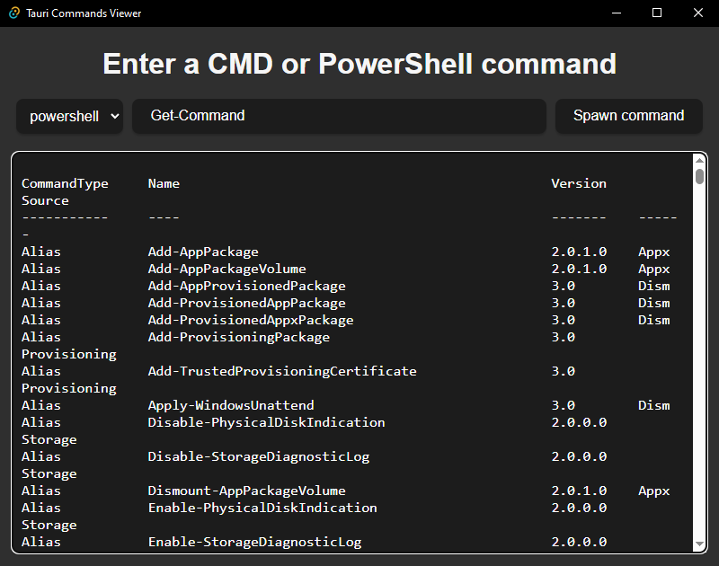

# Tauri + SvelteKit + TypeScript

Used: npm create tauri-app@latest to make a commands viewer for Windows using Tauri v2 and Shell Plugin v2 (cmd and powershell only).

## Example commands

Application: powershell  
Arguments: Get-Process
* Will show your computer's current process

Application: cmd  
Arguments: ["/C", "C:\\\\Program Files\\\\7-Zip\\\\7z.exe"]
* Will show the 7-Zip's CLI version and usage

## Install

npm install

## Run Dev mode

npm run tauri dev

## Build for production

npm run tauri build

# Current Issue

When running in production, the command sometimes just freeze at Loading... and nothing happens (most of the time from cmd with [] arguments). Everything works fine in dev mode. The problem seems to be intermittent on Windows (not tested on MacOS/Linux).

This repo is to help reproduction of the Shell plugin Command issue.

## Screenshot

